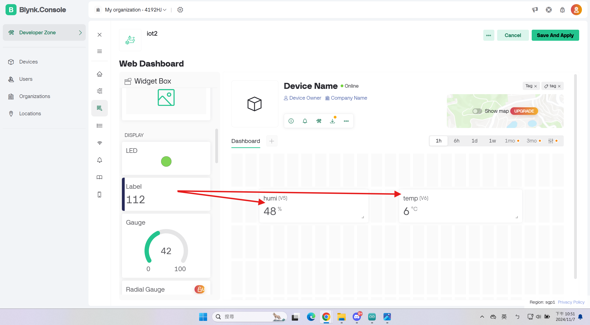

# 1121powermeter update (Handson#2)
In this exercise, students learn how to use IoT platforms to build an IoT project.  
## Blynk QuickStart  
- Blynk.io https://blynk.io/
- Getting start: https://docs.blynk.io/en/getting-started/what-do-i-need-to-blynk
- Support hardware:https://docs.blynk.io/en/getting-started/supported-boards
## Device D1 mini
- Microcontroller (Arduino compatible)
https://www.wemos.cc/en/latest/d1/d1_mini.html
## DHT-11 (Humi/Temp sensor)
https://github.com/dhrubasaha08/DHT11
### Get start
1. Setting the environment:
- Download Arduino: https://www.arduino.cc/en/software

> [!CAUTION]
> Don't forget to install CH340 driver
> - (download CH340 driver) https://www.arduined.eu/ch340-windows-10-driver-download/
> - (how to install) https://forum.arduino.cc/t/how-to-install-ch340-driver-for-windows-11/1154087  

Here is the wiring diagram:  

> [!CAUTION]
> 5V -> (+)  
> G -> (-)  
> D4 -> out  
>  An incorrect wiring connection could result in the component being damaged by overheating.

# Adding D1 board
### Preferences

### • Create direction (folder)
### • Additional Boards Manager URLs:

#### http://arduino.esp8266.com/stable/package_esp8266com_index.json
### Include Library
#### ADD-libraries (given in class)

#### Blynk_Release_v0.4.4 (subject to revise)
##### Board Management
##### Select WEMOS D1 D2 & Mini

##### Select version

##### Downloading

##### Board setting

##### Port setting
### Flash / Speed / Port

#### Confirmation

## Blynk
- Go to blynk website and sign up.
### Create template
#### Add new template.
  
- Enter the template's name.
Hardware choose ESP8266 and connection type is WiFi.
  
#### Go to datastreams
- Add new datastream and choose virtual pin
 
- Name can be HUMIDITY and TEMPERATURE, each name has it own PIN(for example is V5 and V6)
- Type is interger.
- Unit you can use percentage and degrees.
>[!NOTE]
> Because humidity is expressed as a percentage.
> So the range should be 0 to 100.

Like this.
  
  
#### Go to Web dashboard.
- Drag two label to your dashboard.
  
- Click label's setting and change its name.
 
- Choose the datastream you created and save.
  
#### Create device
- Go to device
- Add new device from template
  
> [!NOTE]
> At here, you can see your own token, you need this token and put in arduino D1.
> I suggest you copy first.(You also can find token in Developer tools)
>   
>   

Blynk setting finish at here.
## Arduino code
- Download the code from [HERE](blynk_DHT11.ino)  
- If your program is right, you check serial monitor will see this  
  
# Result
  
## Powermeter
https://www.peacefair.cn/product/772.html
## Reference
- resources: https://github.com/iiotntust/powermeter
